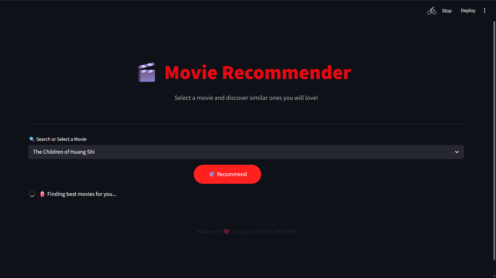

<h1 align="center">🎬 Movie Recommendation System</h1>

A <b>content-based Movie Recommendation Web Application</b> built using
<b>Python</b> and <b>Streamlit</b> that recommends similar movies based on
metadata similarity.

<h2>🚀 Project Overview</h2>

This project implements a <b>content-based recommendation system</b> that helps users
discover movies similar to their preferences. The system analyzes movie metadata such as
<b>genres, keywords, cast, crew, and overview</b> to compute similarity between movies.

The application is deployed as an <b>interactive Streamlit web app</b> with a clean dark-themed
interface and dynamically fetched movie posters using the <b>TMDB API</b>.

<h2>✨ Key Highlights</h2>
<ul>
  <li>Content-based filtering using textual movie metadata</li>
  <li>Similarity matching using <b>Cosine Similarity</b></li>
  <li>Interactive and responsive web interface</li>
  <li>Movie posters and metadata fetched via TMDB API</li>
  <li>Fast recommendations using precomputed model files</li>
</ul>

<h2>🌟 Features</h2>
<ul>
  <li>Search or select a movie from the dropdown</li>
  <li>Recommend top 5 similar movies</li>
  <li>Display movie posters with titles</li>
  <li>Clean and user-friendly Streamlit interface</li>
  <li>Efficient model loading using Pickle</li>
</ul>

<h2>🛠️ Technology Stack</h2>
<ul>
  <li><b>Programming Language:</b> Python</li>
  <li><b>Data Processing:</b> Pandas, NumPy</li>
  <li><b>Machine Learning:</b> Scikit-learn</li>
  <li><b>Text Vectorization:</b> CountVectorizer</li>
  <li><b>Similarity Measure:</b> Cosine Similarity</li>
  <li><b>Web Framework:</b> Streamlit</li>
  <li><b>Model Storage:</b> Pickle</li>
</ul>

<h2>📊 Dataset</h2>

The project uses the <b>TMDB 5000 Movies Dataset</b> and <b>TMDB 5000 Credits Dataset</b>.

<ul>
  <li>Movie titles</li>
  <li>Genres</li>
  <li>Overview</li>
  <li>Keywords</li>
  <li>Cast and crew</li>
</ul>

<h2>⚙️ How It Works</h2>
<ol>
  <li>Movie and credits datasets are merged</li>
  <li>Relevant textual features are combined into a single representation</li>
  <li>Text data is vectorized using CountVectorizer</li>
  <li>Cosine similarity is computed between movies</li>
  <li>Top similar movies are recommended based on similarity scores</li>
</ol>

<h2>▶️ Running the Project Locally</h2>
<pre>
pip install -r requirements.txt
streamlit run app.py
</pre>

<h2>📁 Project Structure</h2>
<pre>
movie-recommendation-system/
│
├── app.py
├── movies.pkl
├── requirements.txt
├── data/
│   ├── tmdb_5000_movies.csv
│   └── tmdb_5000_credits.csv
├── data_understanding.ipynb
├── screenshots/
│   ├── home.png
│   └── recommendations.png
└── README.md
</pre>

<h2>📸 Application Preview</h2>

  

  

<h2>🔮 Future Enhancements</h2>
<ul>
  <li>Collaborative filtering</li>
  <li>Improved feature engineering</li>
  <li>Cloud deployment</li>
</ul>

<h2>👤 Author</h2>

<b>Shivam Nayak</b> 
Aspiring Data Scientist / Machine Learning Engineer

If you find this project useful, please consider giving it a ⭐ on GitHub.

